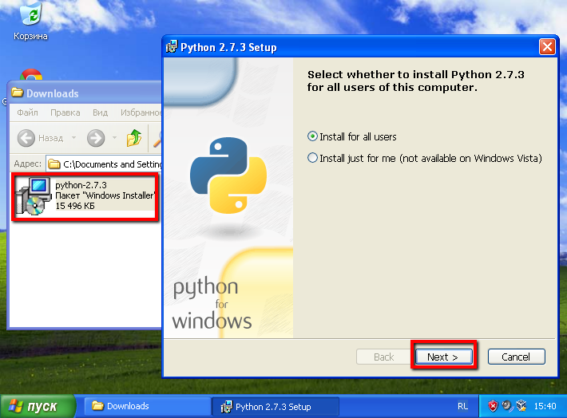
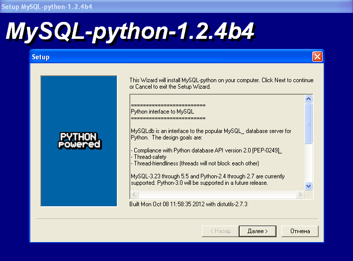
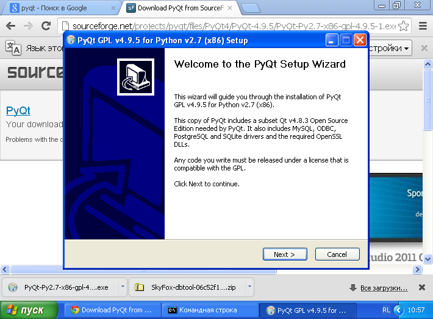
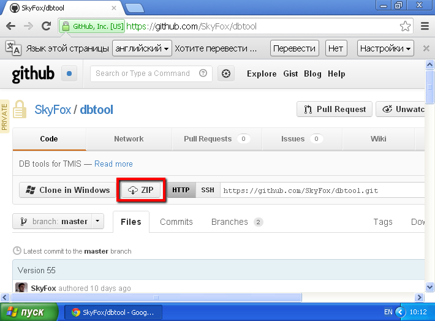
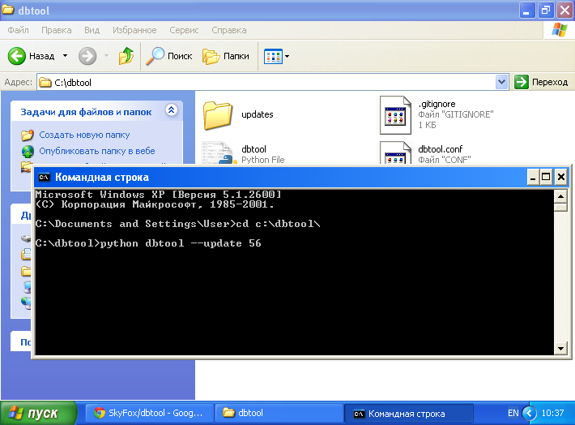

# Руководство по обновлению схемы БД
***
## Требования к ПО
На компьютере должна быть установлена ОС __Windows XP или новее__.

## Процесс установки вспомогательного ПО
1. Установовка Python. Пройдите по ссылке <http://www.python.org/ftp/python/2.7.3/python-2.7.3.msi>. После завершения загрузки запустите скаченный фаил и пройдите процедуру установки не изменяя параметры. После завершения установки добавьте python в список глобальных переменных как указано в видеоролике <http://www.youtube.com/watch?v=QTlCBZB4Ifg>

 

2.  Установовка драйвера MySQL для Python. Пройдите по ссылке <http://sourceforge.net/projects/mysql-python/files/latest/download>. После завершения загрузки запустите скаченный фаил и пройдите процедуру установки не изменяя параметры. 

 

3. Установка PyQt. Пройдите по ссылке <http://sourceforge.net/projects/pyqt/files/PyQt4/PyQt-4.9.5/PyQt-Py2.7-x86-gpl-4.9.5-1.exe>. После завершения загрузки запустите скаченный фаил и пройдите процедуру установки не изменяя параметры. 

 

4. Перейдите на сайт <http://github.com> и войдите под своей учётной записью. При необходимосте создайте новую. Будьте внимательны. Доступ к систему обновлений схемы базы данных ограничен. Если вы используете вновь созданную учётную запись или доступ к программе обновления вам не был предоставлен ранее - обратитесь в отдел разработки. Скачайте архив перейдя по ссылке <https://github.com/SkyFox/dbtool/zipball/master>. 

 

5. Распакуйте архив и скопируйте его содержимое в c:\dbtool.

6. Перейдите в папку c:\dbtool и отредактируйте файл dbtool.conf в соотвествии с настройками вашей БД.

7. Откройте коммандную строку и перейдите в каталог c:\dbtool. Выполните `python dbtool.py --update [DB version]`, где [DB_version] - это целое число, указывающее на ту версию БД, до которой необходимо обновиться. Вывод на экран сообщит вам об успешном обновлении схемы БД. 

 

### Замечания
* Работоспособность ссылок не гарантируется. В случаи их неработоспособности обращайтесь в отдел разработки.
* Не меняйте порядок установки и не устанавливайте пакеты одновременно. Это может привести к некорректной работе компонентов.